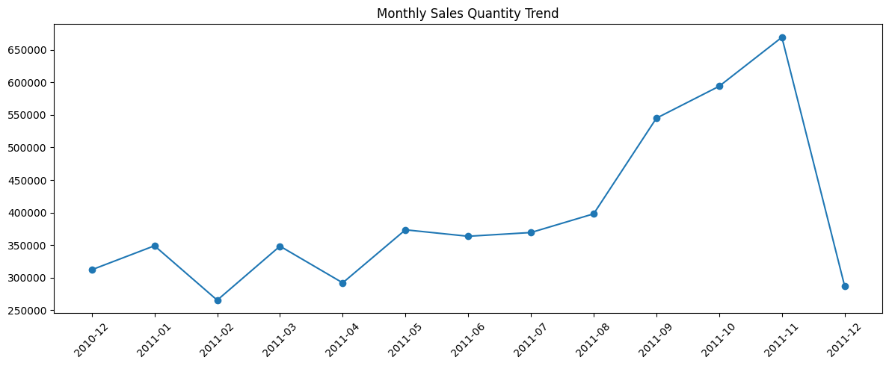
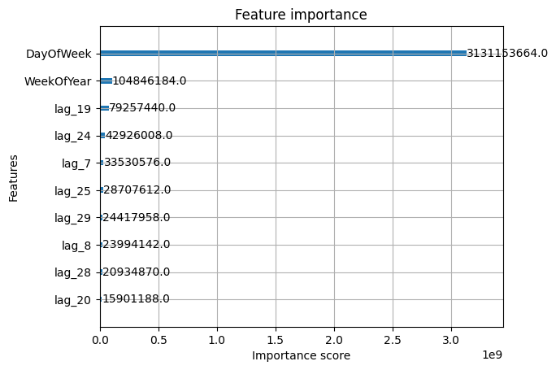
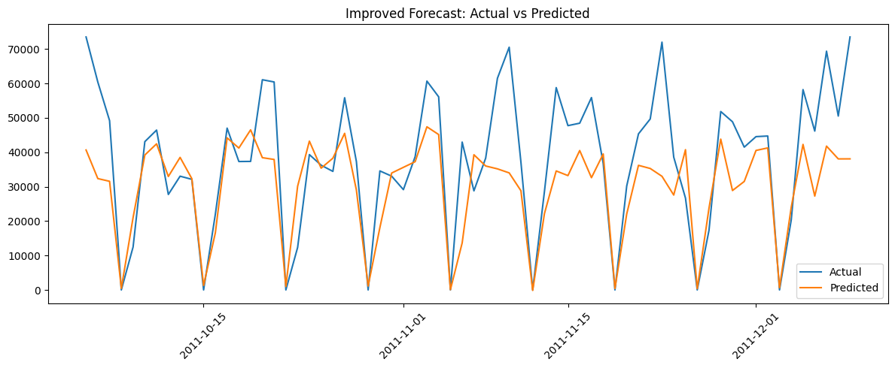

Loading and Inspecting Data


```python
import pandas as pd

file_path = r"C:\Users\User\Downloads\Anaconda\Online Retail\Online Retail.csv"
df = pd.read_csv(file_path, encoding='ISO-8859-1')

# Preview
print(df.head())
print(df.info())
print(df.describe())

```

      InvoiceNo StockCode                          Description  Quantity  \
    0    536365    85123A   WHITE HANGING HEART T-LIGHT HOLDER         6   
    1    536365     71053                  WHITE METAL LANTERN         6   
    2    536365    84406B       CREAM CUPID HEARTS COAT HANGER         8   
    3    536365    84029G  KNITTED UNION FLAG HOT WATER BOTTLE         6   
    4    536365    84029E       RED WOOLLY HOTTIE WHITE HEART.         6   
    
          InvoiceDate  UnitPrice  CustomerID         Country  
    0  1/12/2010 8:26       2.55     17850.0  United Kingdom  
    1  1/12/2010 8:26       3.39     17850.0  United Kingdom  
    2  1/12/2010 8:26       2.75     17850.0  United Kingdom  
    3  1/12/2010 8:26       3.39     17850.0  United Kingdom  
    4  1/12/2010 8:26       3.39     17850.0  United Kingdom  
    <class 'pandas.core.frame.DataFrame'>
    RangeIndex: 541909 entries, 0 to 541908
    Data columns (total 8 columns):
     #   Column       Non-Null Count   Dtype  
    ---  ------       --------------   -----  
     0   InvoiceNo    541909 non-null  object 
     1   StockCode    541909 non-null  object 
     2   Description  540455 non-null  object 
     3   Quantity     541909 non-null  int64  
     4   InvoiceDate  541909 non-null  object 
     5   UnitPrice    541909 non-null  float64
     6   CustomerID   406829 non-null  float64
     7   Country      541909 non-null  object 
    dtypes: float64(2), int64(1), object(5)
    memory usage: 33.1+ MB
    None
                Quantity      UnitPrice     CustomerID
    count  541909.000000  541909.000000  406829.000000
    mean        9.552250       4.611114   15287.690570
    std       218.081158      96.759853    1713.600303
    min    -80995.000000  -11062.060000   12346.000000
    25%         1.000000       1.250000   13953.000000
    50%         3.000000       2.080000   15152.000000
    75%        10.000000       4.130000   16791.000000
    max     80995.000000   38970.000000   18287.000000
    

Data Cleaning

Removing missing values:


```python
df.dropna(subset=['CustomerID', 'Description'], inplace=True)

```

Removing cancelled transactions:


```python
df = df[~df['InvoiceNo'].astype(str).str.startswith('C')]

```

Removing negative or zero quantities and prices:


```python
df = df[(df['Quantity'] > 0) & (df['UnitPrice'] > 0)]

```

Converting date column:


```python
df['InvoiceDate'] = pd.to_datetime(df['InvoiceDate'], dayfirst=True)

```

Exploratory Data Analysis (EDA)

Top selling products:


```python
top_products = df.groupby('Description')['Quantity'].sum().sort_values(ascending=False).head(10)
print(top_products)

```

    Description
    PAPER CRAFT , LITTLE BIRDIE           80995
    MEDIUM CERAMIC TOP STORAGE JAR        77916
    WORLD WAR 2 GLIDERS ASSTD DESIGNS     54415
    JUMBO BAG RED RETROSPOT               46181
    WHITE HANGING HEART T-LIGHT HOLDER    36725
    ASSORTED COLOUR BIRD ORNAMENT         35362
    PACK OF 72 RETROSPOT CAKE CASES       33693
    POPCORN HOLDER                        30931
    RABBIT NIGHT LIGHT                    27202
    MINI PAINT SET VINTAGE                26076
    Name: Quantity, dtype: int64
    

Monthly sales trend:


```python
df['InvoiceMonth'] = df['InvoiceDate'].dt.to_period('M')
monthly_sales = df.groupby('InvoiceMonth')['Quantity'].sum().reset_index()
monthly_sales['InvoiceMonth'] = monthly_sales['InvoiceMonth'].astype(str)

import matplotlib.pyplot as plt
plt.figure(figsize=(12, 5))
plt.plot(monthly_sales['InvoiceMonth'], monthly_sales['Quantity'], marker='o')
plt.title('Monthly Sales Quantity Trend')
plt.xticks(rotation=45)
plt.tight_layout()
plt.show()

```


    

    


Feature Engineering

Total sales per transaction:


```python
df['TotalSales'] = df['Quantity'] * df['UnitPrice']

```

Creating year, month, and weekday features:


```python
df['Year'] = df['InvoiceDate'].dt.year
df['Month'] = df['InvoiceDate'].dt.month
df['DayOfWeek'] = df['InvoiceDate'].dt.dayofweek

```

Aggregating daily sales for forecasting:


```python
daily_sales = (
    df.drop(columns=['InvoiceMonth'], errors='ignore')
      .set_index('InvoiceDate')
      .resample('D')
      .sum(numeric_only=True)[['TotalSales']]
      .reset_index()
)

```

 Preprocessing for Modeling

Handling missing days (fill with 0s):


```python
daily_sales = daily_sales.set_index('InvoiceDate').asfreq('D', fill_value=0).reset_index()

```

Creating lag features for the last 30 days


```python
for lag in range(1, 31):
    daily_sales[f'lag_{lag}'] = daily_sales['TotalSales'].shift(lag)

```


```python
daily_sales.dropna(inplace=True)

```

Adding Time-Based Features


```python
daily_sales['DayOfWeek'] = daily_sales['InvoiceDate'].dt.dayofweek      
daily_sales['Month'] = daily_sales['InvoiceDate'].dt.month
daily_sales['IsWeekend'] = daily_sales['DayOfWeek'].isin([5, 6]).astype(int)
daily_sales['WeekOfYear'] = daily_sales['InvoiceDate'].dt.isocalendar().week.astype(int)

```

Handle Outliers in TotalSales


```python
cap_value = daily_sales['TotalSales'].quantile(0.99)
daily_sales['TotalSales'] = daily_sales['TotalSales'].clip(upper=cap_value)

```

Preparing X and y 


```python
X = daily_sales.drop(['InvoiceDate', 'TotalSales'], axis=1)
y = daily_sales['TotalSales']

```

 Train-Test Split


```python
from sklearn.model_selection import train_test_split

X_train, X_test, y_train, y_test = train_test_split(X, y, shuffle=False, test_size=0.2)

```


```python
daily_sales['rolling_mean_7'] = daily_sales['TotalSales'].rolling(window=7).mean().shift(1)
daily_sales['rolling_std_7'] = daily_sales['TotalSales'].rolling(window=7).std().shift(1)
daily_sales.dropna(inplace=True)

```


```python
daily_sales['IsNoSaleDay'] = (daily_sales['TotalSales'] == 0).astype(int)

```

Modeling


```python
from xgboost import XGBRegressor

model = XGBRegressor(n_estimators=200, max_depth=10, learning_rate=0.1, random_state=42)
model.fit(X_train, y_train)
y_pred = model.predict(X_test)

print(" RMSE:", mean_squared_error(y_test, y_pred, squared=False))
print(" R²:", r2_score(y_test, y_pred))

```

     RMSE: 14960.070759467466
     R²: 0.4616524337355804
    

Visualization


```python
from xgboost import plot_importance
plot_importance(model, max_num_features=10, importance_type='gain')
plt.show()

```


    

    


```python
import matplotlib.pyplot as plt

plt.figure(figsize=(12,5))
plt.plot(daily_sales['InvoiceDate'].iloc[-len(y_test):], y_test, label="Actual")
plt.plot(daily_sales['InvoiceDate'].iloc[-len(y_test):], y_pred, label="Predicted")
plt.title("Improved Forecast: Actual vs Predicted")
plt.xticks(rotation=45)
plt.legend()
plt.tight_layout()
plt.show()

```


    

    

